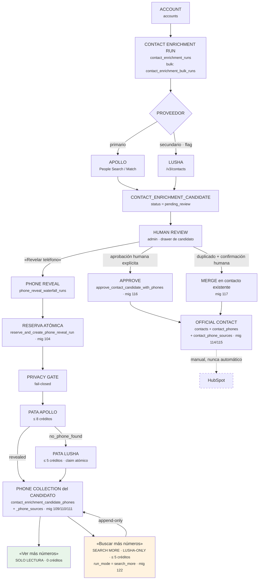

# Agente 2A — Arquitectura

> Base: `origin/main` @ `807e9da7`. Todas las rutas de código son verificables en ese commit.

---

## 1. El flujo end-to-end



**Lectura del diagrama.** La línea punteada hacia HubSpot es deliberada: Agente 2A **no
escribe en HubSpot automáticamente en ningún punto**. Lee HubSpot para resolver la empresa y
para detectar duplicados; escribir es una acción separada y humana.

---

## 2. Las capas, y qué responsabilidad tiene cada una

El subsistema está deliberadamente partido en cuatro capas, y la separación no es estética:
es lo que permite probar decisiones caras **offline, con 0 proveedores y 0 créditos**.

### 2.1 Cores PUROS

Sin I/O, sin `process.env`, sin Supabase, sin `fetch`, sin `Date.now()`, sin `console`.
Los flags llegan ya resueltos como booleanos; el reloj entra como argumento; el presupuesto
llega como dato.

| Módulo | Decide |
|---|---|
| `phone-reveal-waterfall-core.ts` | Orquestación de las dos patas, vocabulario de estados, topes, TTL de 24 h |
| `phone-reveal-credit-budget-core.ts` | ¿Alcanza el pozo de ESTE proveedor para ESTA pata? |
| `phone-reveal-credit-reservation-core.ts` | Ciclo de vida de la reserva: reservar, confirmar, liberar |
| `phone-reveal-identity-eligibility.ts` | ¿Existe la clave con la que la supresión podría consultarse? |
| `provider-suppression-core.ts` | Identidad nativa del proveedor y decisión de supresión |
| `phone-collection-core.ts` | Normalización, dedupe, ranking de tipo, elección del principal |
| `search-more-phones-planner.ts` | ¿Puede este candidato pedir números adicionales, a quién y a qué costo máximo? |
| `search-more-phones-core.ts` | Traduce «qué contestó el proveedor» + «qué se pudo guardar» en el patch de cierre |
| `official-contact-approval-core.ts` | Inversión de procedencia heredada + parámetros de la RPC 116 |
| `lusha-phone-fallback-core.ts` | Elegibilidad del fallback manual de Lusha |

> **Por qué importa que sean puros.** El planificador de Search More vive separado del JSX
> *y* separado del runtime por la misma razón: el botón y el servidor tienen que decidir con
> la MISMA función. Un planificador embebido en el componente obligaría al servidor a
> reimplementar la regla, y la primera divergencia sería un botón que ofrece una compra que
> el servidor rechaza. Eso ocurrió de verdad — es el incidente que cerró el PR #309.

### 2.2 Deps / stores (I/O aislado)

Traducen entre los cores puros y PostgREST/RPC. Son el único sitio con acceso a Supabase.

`phone-reveal-waterfall-deps.ts` · `phone-reveal-credit-budget-deps.ts` ·
`phone-reveal-credit-reservation-deps.ts` · `provider-suppression-store.ts` ·
`candidate-phone-collection-writer.ts` · `candidate-search-more-phone-append-persistence.ts` ·
`official-contact-approval-persistence.ts` · `existing-contact-merge-persistence.ts`

### 2.3 Runtimes / server actions

Componen la secuencia real y son las únicas que gastan dinero.

`phone-reveal-actions.ts` · `phone-reveal-waterfall-actions.ts` ·
`phone-reveal-waterfall-legacy-actions.ts` · `lusha-phone-fallback-actions.ts` ·
`search-more-phones-runtime.ts` + `search-more-phones-actions.ts` ·
`candidate-stored-phones-actions.ts` (sólo lectura) ·
`official-contact-stored-phones-actions.ts` (sólo lectura) ·
`phone-reveal-recovery-actions.ts` · `phone-reveal-manual-recovery-actions.ts`

### 2.4 UI

`contact-candidate-detail-sheet.tsx` (el drawer donde vive casi toda la operación) ·
`contact-candidates-data-table-client.tsx` ·
`phone-reveal-submission-latch-core.ts` + `phone-reveal-live-refresh-core.ts` (ciclo asíncrono).

La UI **nunca** es la autoridad. Es conveniencia: que el botón no se pinte no es la
protección — la protección es que las server actions no devuelven nada a quien no está
autorizado, aunque las invoque directamente con un UUID en la mano.

### 2.5 La invariante transversal

Las funciones SQL (migraciones 110, 111, 112, 113, 116, 117, 122) son la **última** capa, y
existen porque PostgREST no expone `BEGIN`/`COMMIT`. Todo lo que tiene que ser atómico
—persistir un reveal, propagar una DSAR, aprobar un candidato, apilar números nuevos— vive
ahí y no en TypeScript.

---

## 3. Call graphs

### 3.1 Enrichment individual

```
UI (wizard de enriquecimiento)
  └─ contact-enrichment/actions.ts
       ├─ hubspot-account-resolver.ts        ← resuelve empresa (con AbortSignal.timeout, #279)
       ├─ server/agents/contact-enrichment-toolkit/…  ← Apollo People Search
       │    └─ lusha-enrichment-runner.ts    ← sólo si ENABLE_LUSHA_CONTACT_ENRICHMENT
       ├─ request-persistence-core.ts        ← contact_enrichment_requests
       └─ → contact_enrichment_runs + contact_enrichment_candidates (pending_review)
```

### 3.2 Enrichment bulk

```
UI (acción por cuenta)
  └─ bulk-enrichment-actions.ts
       └─ bulk-enrichment-runner.ts
            ├─ bulk-enrichment-eligibility.ts   ← qué cuentas entran
            └─ por cada cuenta: el MISMO camino individual
                 └─ contact_enrichment_bulk_runs (agregado: procesadas/ok/fallidas/candidatos)
```

No hay bulk de *phone reveal*. La entrada de toda operación de teléfono es escalar.

### 3.3 Candidate review

```
contact-candidate-detail-sheet.tsx
  ├─ getReviewableContactCandidateById         ← candidate-review-core.ts
  ├─ getPhoneRevealWaterfallAuditAction        ← phone-reveal-suppression-audit.ts
  ├─ getCandidateStoredPhonesSummary / …List   ← candidate-stored-phones-actions.ts (SOLO SELECT)
  └─ getSearchMorePhonesPreflightAction        ← search-more-phones-read.ts → planner
```

### 3.4 Reveal de teléfono (waterfall Apollo → Lusha)

```
1. revealCandidatePhoneAction            (phone-reveal-waterfall-actions.ts)
2. evaluatePhoneRevealWaterfallStart     (core puro)  → modalidad + topes
3. readPhoneRevealCreditPools            (deps)       → pozos por proveedor
4. evaluatePhoneRevealCreditBudget       (core puro)  → authorized | insufficient | not_configured | unavailable
5. reserveWaterfallCreditsAndCreateRunOrBlock
      └─ RPC reserve_and_create_phone_reveal_run   ← mig 104: RESERVA + RUN en UNA transacción
6. checkPhoneRevealPrivacyGate           (fail-closed)
7. PATA APOLLO  → start async → webhook | recovery poll
8. si apollo_outcome = no_phone_found:
      claimLushaAttempt   UPDATE … WHERE lusha_attempted_at IS NULL   ← claim atómico
      → PATA LUSHA (una llamada, sin retry)
9. persistencia transaccional   ← RPC mig 110 (Apollo) / 111 (Lusha), con recheck de supresión (mig 113)
10. cierre de la corrida → liquidación de la reserva contra el costo REAL de cada pata
```

### 3.5 Search More

Ver la secuencia numerada completa —los 9 pasos y las 3 barreras de idempotencia— en
[PHONE_REVEAL_AND_SEARCH_MORE.md](PHONE_REVEAL_AND_SEARCH_MORE.md) § 6.4.
La cabecera de `search-more-phones-runtime.ts` es la fuente normativa.

### 3.6 Aprobación a contacto oficial

```
approveContactCandidateAction
  ├─ checkAccountActiveForContact        ← modules/contacts/account-active-guard.ts
  ├─ findDuplicateContact                ← si duplica: termina en `duplicate`, NO aprueba
  ├─ buildApprovalParams                 ← official-contact-approval-core.ts (puro)
  └─ RPC approve_contact_candidate_with_phones   ← mig 116, ATÓMICA:
        accounts · contact_enrichment_runs · contacts
        · contact_phones + contact_phone_sources · candidato → approved · contact_audit
```

La rama de duplicado no es un callejón sin salida desde el PR #277: existe una **segunda**
operación, separada y humano-confirmada, que añade la información del candidato al contacto
que ya existe (`merge_candidate_into_existing_contact`, migración 117).

---

## 4. Fronteras que el código impone (no sólo documenta)

| Frontera | Cómo se impone |
|---|---|
| «Ver más números» no puede gastar | El módulo no importa el cliente de Apollo, ni el de Lusha, ni el motor del waterfall, ni el reservador, ni el logger de uso — y un **test estático falla** si alguna importación aparece |
| Search More no puede llamar a Apollo | `SEARCH_MORE_PROVIDERS` es un conjunto cerrado de un elemento; el mapa de topes es exhaustivo sobre ese tipo, así que añadir Apollo **rompe la compilación** en vez de autorizarse solo |
| Ningún módulo `'use server'` puede exportar algo que no sea una función async | Ratchet con AST de TypeScript sobre los 52 módulos `'use server'` del repo, más el validador REAL de Next sobre tres flujos (ver incidente P0-R4) |
| Las constantes de crédito no pueden divergir | Los topes se reflejan en varios cores dependency-free y un test estático verifica que sigan siendo iguales a su autoridad |
