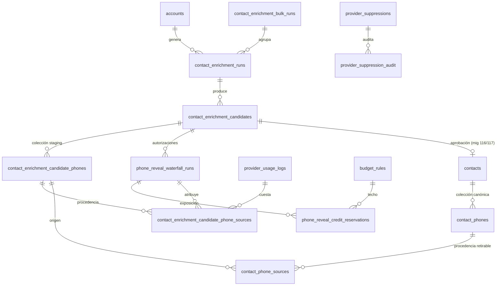

# Agente 2A — Modelo de datos

> Verificado contra el esquema **real** de Producción (`lrdruowtadwbdulndlph`) el 2026-08-19,
> no contra las cabeceras de las migraciones.
>
> **Nota de nombres.** Las tablas de supresión nativa se llaman `provider_suppressions` y
> `provider_suppression_audit` — **no** `provider_phone_suppressions`. La tabla de auditoría
> del contacto se llama `contact_audit`, no `contact_audit_log`.

---

## 1. Clasificación de cada tabla

| Tabla | Clase | Una frase |
|---|---|---|
| `contact_enrichment_runs` | **staging / proceso** | Una corrida de enriquecimiento sobre una cuenta |
| `contact_enrichment_bulk_runs` | **staging / proceso** | Agregado de N corridas lanzadas juntas |
| `contact_enrichment_requests` | **audit** | Intentos y resolución de la petición al proveedor |
| `contact_enrichment_candidates` | **staging** | La persona propuesta, antes de existir oficialmente |
| `contact_enrichment_candidate_phones` | **staging canónica** | Colección de teléfonos DEL CANDIDATO |
| `contact_enrichment_candidate_phone_sources` | **audit / procedencia** | Quién trajo cada número del candidato, cómo y bajo qué autorización |
| `phone_reveal_waterfall_runs` | **ledger de autorización** | Una fila por clic autorizado; hasta dos patas |
| `phone_reveal_credit_reservations` | **ledger de crédito** | Exposición reservada, confirmada o liberada |
| `phone_reveal_cache` | **caché + tombstone** | Reveal de Apollo reutilizable por cuenta+país; también tumba de supresión legacy |
| `provider_suppressions` | **canonical de privacidad** | Tumba durable por identidad NATIVA del proveedor |
| `provider_suppression_audit` | **audit** | Qué se intentó suprimir, con qué resultado, sin PII |
| `phone_reveal_suppression_audit` | **audit** | Auditoría de la DSAR legacy con contadores de filas afectadas |
| `contacts` | **canonical** | El contacto OFICIAL |
| `contact_phones` | **canonical** | Colección de teléfonos DEL CONTACTO OFICIAL |
| `contact_phone_sources` | **audit / procedencia** | Procedencia por número oficial, retirable por proveedor |
| `contact_audit` | **audit** | Historial de cambios del contacto |
| `provider_usage_logs` | **ledger de gasto** | Lo que costó cada llamada a cada proveedor |
| `budget_rules` | **configuración** | Techo por (proveedor × scope × período) |

---

## 2. La distinción que más importa

### CANDIDATE PHONE COLLECTION vs OFFICIAL CONTACT PHONE COLLECTION

Son **dos colecciones distintas**, no la misma tabla vista dos veces. La auditoría 4O-H0 se
preguntó explícitamente si las tablas del candidato podían servir de almacén durable y
concluyó que **no**, por razones que son propiedades de la identidad, no del código:

* `candidate_id` es la identidad equivocada para un registro oficial — el registro oficial es
  el contacto;
* dos candidatos que resuelven a la MISMA persona dejarían huérfana una colección de teléfonos
  ya pagada;
* el ciclo de vida del candidato (se archiva, se descarta, se rechaza) no es el del contacto.

| | Candidato | Contacto oficial |
|---|---|---|
| Colección | `contact_enrichment_candidate_phones` | `contact_phones` |
| Procedencia | `contact_enrichment_candidate_phone_sources` | `contact_phone_sources` |
| Creada por | mig **109** | mig **114** |
| Escrita por | RPC 110 (Apollo), 111 (Lusha), 122 (Search More append) | RPC 116 (aprobación), 117 (merge) |
| Borrada por | RPC 112, 113 | RPC 115 (borrado por proveedor) |
| Supresión | `suppressed_at` **en la fila del teléfono** | `suppressed_at` **en la fila de PROCEDENCIA** + tombstone del número |
| Lifecycle | muere con la revisión del candidato | durable |

> La asimetría de la supresión es deliberada y es lo que arregló el PR #269: un número oficial
> puede estar sostenido por Apollo **y** por Lusha a la vez. Borrar la procedencia de Apollo no
> puede matar el número que Lusha sigue sosteniendo legítimamente. Por eso el borrado oficial
> retira **procedencias**, y sólo tumba el número cuando ya no le queda ninguna.

---

## 3. Tabla por tabla

### 3.1 `contact_enrichment_runs`

* **Propósito:** una corrida de enriquecimiento sobre una cuenta.
* **PK:** `id` (uuid).
* **Relaciones:** `account_id → accounts`, `bulk_run_id → contact_enrichment_bulk_runs`,
  `request_id → contact_enrichment_requests`, `hubspot_company_id` (externo).
* **Columnas relevantes:** `status`, `providers_used`, `intended_provider`, `routing_mode`,
  `provider_attempt_role`, `fallback_reason`, `routing_policy_version`, `attempt_order`,
  `estimated_cost_usd`, `real_cost_usd`.
* **Estados observados en Producción:** `ready_to_enrich`, `ready_for_review`, `completed`,
  `superseded` (mig 077), `failed`.
* **Escribe:** el runner de enriquecimiento. **Lee:** la UI de revisión y la aprobación.
* **Privacidad:** contiene datos de EMPRESA, no de persona.

### 3.2 `contact_enrichment_bulk_runs`

* **Propósito:** agregado de una ejecución masiva por cuenta (mig 078).
* **Columnas relevantes:** `selected_account_ids`, `eligible_account_ids`, `skipped_accounts`,
  `total_processed / _succeeded / _failed / _skipped`, `total_candidates_created`,
  `estimated_apollo_credits`.
* **No** existe bulk de phone reveal ni de Search More.

### 3.3 `contact_enrichment_candidates`

* **Propósito:** la persona propuesta, en estado de revisión.
* **Columnas clave para Agente 2A:** `source` (`apollo` | `lusha` | …), `source_contact_id`
  (id nativo de Lusha), `apollo_person_id` (mig 098), `status`, `phone`,
  `phone_reveal_status`, `phone_reveal_provider`, `phone_reveal_requested_at`,
  `phone_reveal_completed_at`, `phone_reveal_cost_credits`, `phone_reveal_cost_source`,
  `enrichment_metadata`, `linkedin_url`.
* **Estados terminales (no editable):** `approved`, `rejected`, `discarded`, `archived`.
  `duplicate` tiene su propia cola.
* **Privacidad:** **PII directa.** Nombre, email, teléfono, LinkedIn.

> Las columnas `phone_reveal_*` describen **la autorización inicial**. Una corrida
> `search_more` **no las reescribe en ninguna rama** — la migración 122 no las toca.

### 3.4 `contact_enrichment_candidate_phones` (mig 109)

`id, candidate_id, normalized_phone, display_phone, dedupe_key, phone_type, phone_status,
is_primary, first_seen_at, last_seen_at, suppressed_at, suppression_reason, suppressed_by,
created_at, updated_at`

* **PK:** `id`. **FK:** `candidate_id`. **Dedupe:** `dedupe_key` (único por candidato).
* `is_primary`: exactamente uno vivo por candidato; se re-elige atómicamente cuando el
  principal se suprime (mig 112).
* **Privacidad:** PII. `suppressed_at` es el tombstone.

### 3.5 `contact_enrichment_candidate_phone_sources` (mig 109)

`id, candidate_phone_id, provider, acquisition_mode, raw_provider_type, raw_provider_status,
waterfall_run_id, reservation_id, provider_usage_log_id, source_event_key, observed_at,
created_at`

Esta tabla es la que hace **auditable el dinero**: enlaza cada número con
la corrida que lo autorizó (`waterfall_run_id`), la reserva que lo pagó (`reservation_id`) y la
fila del ledger de gasto (`provider_usage_log_id`).

* `acquisition_mode`: `reveal` | `cache` | `search` | `manual`.
* `raw_provider_type` / `raw_provider_status`: el valor **crudo** del proveedor, nunca se pierde.
* `source_event_key`: discriminante de la observación, para que dos fases del mismo reveal
  (Apollo escribe `start` y `webhook`) no colapsen en una sola procedencia.
* **Append-only en la práctica.** No se reescribe procedencia; se añade.

### 3.6 `phone_reveal_waterfall_runs` (mig 102, 103, 104, 122)

`id, candidate_id, status, authorized_at, authorized_by, authorized_by_role,
max_credits_authorized, apollo_attempted_at, apollo_outcome, apollo_cost_credits,
apollo_cost_source, lusha_eligible, lusha_skipped_reason, lusha_attempted_at, lusha_outcome,
lusha_cost_credits, lusha_cost_source, final_provider, completed_at, error_code, created_at,
updated_at, run_mode, credit_reservation_group_id, authorization_key`

* **`run_mode`** (mig 103 + 122): `full_waterfall` | `legacy_lusha_only` | `search_more`.
* **Estados no terminales:** `authorized`, `apollo_in_flight`, `lusha_pending`, `lusha_running`.
* **Estados terminales:** `completed_apollo`, `completed_lusha`, `exhausted`, `error`, `aborted`.
* **Índice único parcial:** una sola corrida **activa** por candidato. Es la segunda barrera de
  idempotencia y vive dentro de la transacción.
* **`authorization_key`** (mig 104 / 4F): clave de idempotencia generada **antes** de la
  operación; un reintento devuelve la misma corrida en vez de autorizar una segunda.
* **`lusha_attempted_at`** es el **claim atómico**: `UPDATE … WHERE lusha_attempted_at IS NULL`.
  Se sella **antes** de llamar al proveedor. El cierre nunca lo reescribe — moverlo de «se
  reclamó» a «se terminó» perdería la garantía.
* Los costos de Apollo y Lusha viven en **columnas separadas y nunca se suman**.
* **Privacidad:** PII-free. No guarda teléfonos ni nombres.

### 3.7 `phone_reveal_credit_reservations` (mig 104)

`id, reservation_group_id, candidate_id, run_id, provider_key, credits_reserved,
credits_confirmed, cost_truth, status, scope_type, scope_id, period_start, period_end,
limit_credits, authorized_by, created_at, confirmed_at, released_at, release_reason`

* Una fila **por proveedor** dentro de un `reservation_group_id`. La reserva es
  *all-or-nothing* sobre el grupo.
* `status`: `active` → `confirmed` | `released`.
* `cost_truth`: distingue costo `reported` de `unknown`. **Un costo desconocido nunca se
  liquida como 0.**
* La corrida nace con `credit_reservation_group_id`, así que **no existe** una corrida cuya
  reserva no se pueda encontrar para liquidarla.

### 3.8 `provider_suppressions` (mig 120)

`id, provider, provider_person_id, suppressed_at, suppression_reason, suppressed_by,
created_at, updated_at`

* Clave de privacidad **nativa del proveedor** e **independiente de la cuenta**.
* `provider` ∈ {`apollo`, `lusha`} — allowlist cerrada en espejo del CHECK.
* Sustituye a la clave heredada de la caché `(apollo, provider_person_id, account_id)`, que
  nunca se diseñó para privacidad y arrastraba tres consecuencias equivocadas: sin cuenta no
  había clave, un candidato de origen Lusha no podía llevar clave alguna, y la supresión moría
  con la cuenta (`ON DELETE CASCADE`).
* **Producción hoy: 0 filas.**

### 3.9 `provider_suppression_audit` (mig 120) y `phone_reveal_suppression_audit` (mig 099)

Ambas son PII-free: guardan `provider_person_id_hash`, nunca el id crudo. La segunda además
cuenta filas afectadas por la DSAR legacy (`candidates_cleared`, `contacts_cleared`,
`cache_rows_suppressed`, `candidate_phone_rows_suppressed`, `official_phone_sources_suppressed`,
`official_phone_rows_tombstoned`).

### 3.10 `contacts`, `contact_phones`, `contact_phone_sources` (mig 114, 115)

`contact_phones` tiene la **misma forma** que la colección del candidato.
`contact_phone_sources` añade tres columnas que la del candidato no tiene:
`candidate_phone_id` (trazabilidad al origen), y `suppressed_at` / `suppression_reason` /
`suppressed_by` — porque la unidad de borrado oficial es la **procedencia**, no el número.

### 3.11 `provider_usage_logs`

El ledger canónico de gasto de toda la plataforma. Columnas relevantes para 2A:
`provider_key`, `operation_key`, `credits_used`, `real_cost_usd`, `status`, `reservation_id`,
`client_request_id`, `idempotency_key`, `billing_state`, `batch_id`, `usage_key`.

Apollo escribe **dos** filas por reveal (`start` = llamada real, `webhook` = recepción). Por eso
la procedencia lleva `source_event_key`: sin él, las dos observaciones colapsarían.

### 3.12 `budget_rules`

`id, provider_key, scope_type, scope_id, period_type, limit_credits, limit_usd, on_exceed,
is_active, notes, created_by, created_at, updated_at`

Una regla por (`provider_key` × `scope`). Resolución de scope:
**user → group (ancestro más cercano) → role → global** (`matchRule` en
`src/modules/budgets/budget-resolution.ts`).

---

## 4. Diagrama de relaciones

